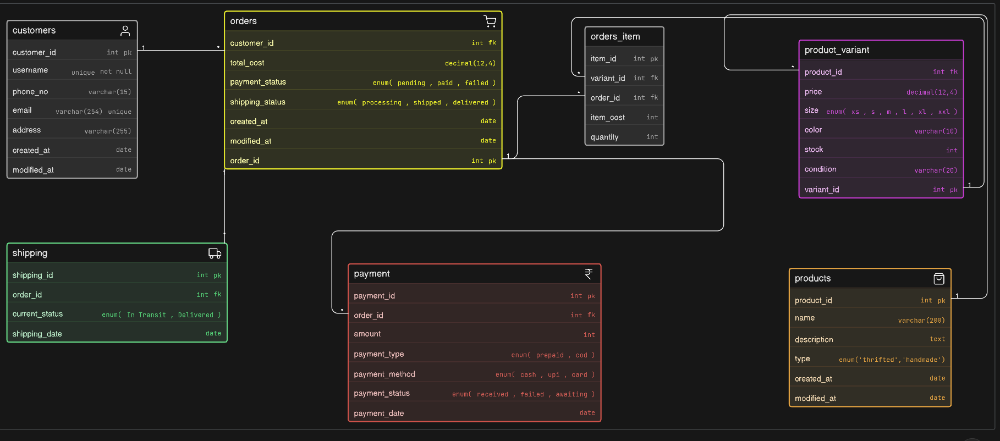

# 🛍️ Instagram Thrift Store – Database Design (ER Diagram)

This project presents the **Entity-Relationship (ER) diagram** for a growing Instagram-based thrift and handmade products store. The goal is to design a **scalable and normalized database** to manage products, inventory, customer orders, payments, and shipping.

---

## 📌 Problem Context

The business initially handled orders through Instagram DMs and WhatsApp. As it scaled, there was a need to:

* Track customers and their orders
* Manage unique thrift items and multi-stock handmade products
* Handle payments and delivery status
* Maintain structured product and inventory data

---

## 🧠 Design Highlights

* ✅ Supports **both thrift (single-unit)** and **handmade (multi-unit)** products
* ✅ Uses **Product + Product Variant separation** for flexibility
* ✅ Implements **many-to-many relationship** using `order_items` (junction table)
* ✅ Tracks **payment and shipping status independently**
* ✅ Follows **normalized database design principles**

---

## 🗂️ Entities Overview

### 👤 Customers

Stores user information such as name, contact, and address.

### 🛒 Orders

Represents each order placed by a customer, including:

* Total cost
* Payment status
* Shipping status

### 📦 Order Items

Acts as a **junction table**:

* Links orders with product variants
* Stores quantity and price at purchase

### 🛍️ Products

Contains general product details:

* Name, description
* Type: `thrifted` or `handmade`

### 🎨 Product Variants

Handles inventory-level details:

* Size, color
* Stock quantity
* Condition (important for thrift items)

### 🚚 Shipping

Tracks delivery status of each order.

### 💳 Payment

Stores transaction details:

* Payment method
* Payment status
* Amount paid

---

## 🔗 Relationships

* One **customer** can place multiple **orders**
* One **order** can contain multiple **order items**
* Each **order item** refers to a specific **product variant**
* Each **product** can have multiple **variants**
* Each **order** has associated **payment** and **shipping** details

---

## 🖼️ ER Diagram

---

## ⚙️ Key Design Decisions

### 1. Product vs Variant Separation

Instead of storing size/color in products:

* `products` → general info
* `product_variant` → inventory-specific details

This allows:

* Multiple sizes/colors per product
* Clean inventory management

---

### 2. Handling Thrift vs Handmade

* **Thrift items** → single variant, stock = 1
* **Handmade items** → multiple variants, stock > 1

This avoids creating separate tables while keeping logic simple.

---

### 3. OrderItems as Junction Table

Solves:

> “One order can contain multiple products”

By linking:

* `orders` ↔ `product_variant`

---

### 4. Separation of Concerns

* **Orders** → summary (status, total)
* **Payment** → transaction details
* **Shipping** → delivery tracking

---

## 🚀 Future Improvements

* Add **order status history tracking**
* Introduce **user authentication system**
* Add **reviews/ratings system**
* Support **returns and refunds**

---

## 📌 Conclusion

This design provides a **scalable and real-world ready database structure** for a small e-commerce business transitioning from informal platforms to a structured system.

It ensures:

* Flexibility
* Data consistency
* Ease of querying

---

## 👨‍💻 Author

Developed as part of a database design assignment focused on practical system modeling.
